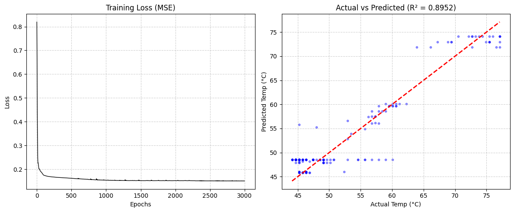

# Tattva
A predictive framework designed to map the non-linear thermodynamics of Raspberry Pi hardware. By processing high-frequency telemetry data (CPU, Frequency, RAM), the model utilizes a Multi-Layer Perceptron (MLP) to forecast thermal spikes, enabling proactive power management over reactive throttling.
This project implements a Multilayer Perceptron (MLP) to predict the real-time thermal behavior of a Raspberry Pi System-on-Chip (SoC). Unlike static thresholds, this model learns the non-linear relationship between CPU utilization, clock frequency, and RAM pressure to forecast heat generation.

# Technical Stack
* **Data Collection**: Custom Python telemetry script using psutil.
* **Deep Learning**: PyTorch (nn.Module, nn.Sequential).
* **Data Engineering**: Scikit-Learn (StandardScaler, train_test_split).
* **Visualisation**: Matplotlib, Seaborn.

# Physics 
Thermal dynamics in silicon are rarely linear. While a simple regression follows the formula:
$y = Wx + b$
This model utilizes a ReLU-activated Neural Network to capture the "Saturation Effect"—where the temperature delta decreases as the SoC approaches ambient equilibrium. We optimize the model using Mean Squared Error (MSE) loss:
$MSE = \frac{1}{n} \sum_{i=1}^{n} (y_i - \hat{y}_i)^2$

# Project Structure
* collect_pi.py: Telemetry script for high-frequency sensor logging on the Raspberry Pi.

* stress_test.sh: Bash script to generate varied thermal loads (Idle, Burst, Sustained).

* Silicon_Thermals_Training.ipynb: The Google Colab notebook for model architecture and evaluation.

* pi_thermal_data.csv: The raw telemetry dataset.

# Results and Visualisation
The model is evaluated based on the Coefficient of Determination ($R^2$).
* Training Loss: Successfully minimized using a 16-8-1 architecture.
* Accuracy: The model identifies the "Thermal Inertia" (the lag between CPU spikes and temperature rise).
* Note on Debugging: During development, I encountered a Negative Temperature Prediction anomaly. This was       identified as a Feature Scaling Inversion—a classic data engineering hurdle solved by properly implementing inverse_transform on the standardized output.

# How to Run?
1. Data Collection - You may use your own dataset instead of the set i got from my Pi, to get an independent dataset from your pi computer, ensure that you have psutil installed.
   `python3 collect_pi.py`
   In a separate terminal,
   `./stress_test.sh`
2. Training - Upload your pi_thermal_data.csv to the notebook and execute the cells. The model uses an Adam Optimizer with an adaptive learning rate to converge on the thermal "signature" of your specific hardware.
  
